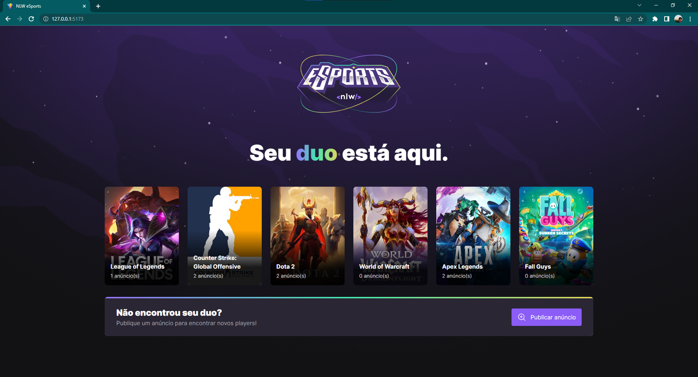
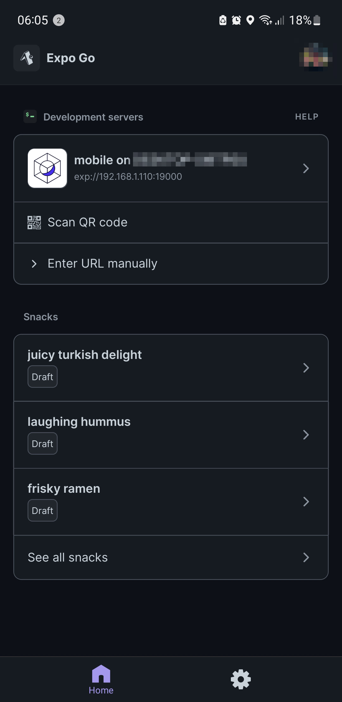

<h1><b>NLW Ignite eSports</b></h1>

Bem-vindo ao repositório baseado no curso da semana **NLW eSports** da **[Rocketseat](https://www.rocketseat.com.br) 🚀** que aconteceu _11 a 18 de setembro de 2022_.

<div align="center" width="100%">
  
</div>

# 📑 Sumário

- [📑 Sumário](#-sumário)
- [🤔 Problemática](#-problemática)
- [✔️ Proposta](#️-proposta)
- [🧰 Ferramentas utilizadas](#-ferramentas-utilizadas)
- [Abrindo o projeto pela primeira vez](#abrindo-o-projeto-pela-primeira-vez)
  - [Node](#node)
  - [Git](#git)
  - [Instalando as dependências e abrindo a aplicação](#instalando-as-dependências-e-abrindo-a-aplicação)
    - [Instalando as dependências manualmente](#instalando-as-dependências-manualmente)
- [📁 Servidor](#-servidor)
  - [Executando o servidor](#executando-o-servidor)
  - [Interface gráfica do banco de dados (Prisma)](#interface-gráfica-do-banco-de-dados-prisma)
- [💻 Versão Web](#-versão-web)
  - [Executando o Vite](#executando-o-vite)
- [📱 Versão Mobile](#-versão-mobile)

# 🤔 Problemática

Muitos gamers não têm uma forma centralizada de encontrar duplas para seus jogos

# ✔️ Proposta

Este treinamento foi realizado com o propósito de solucionar um _problema fictício_ de gamers que têm dificuldade em encontrar uma dupla para jogar. Para isso foi pensado uma aplicação na qual os gamers podem registrar o jogo do qual gostariam de **encontrar um "duo"** e esperar que alguém entre em contato para iniciarem a jogatina.

# 🧰 Ferramentas utilizadas

- ReactJS 
- React Native 
- Tailwind 
- Expo 
- Node.js 
- Vite 
- TypeScript 
- Prisma 
- Figma 

# Abrindo o projeto pela primeira vez

Para abrir o projeto é necessário ter o **Node.js** e o **Git** instalados no seu computador.

## Node

Caso não tenha acesse o [site oficial](https://nodejs.org/) e siga as instruções para a sua instalação. Caso não tenha certeza, abra um terminal e tente o comando `node -v` e aguarde uma resposta caso esteja instalado.

## Git

Para instalar o Git siga as instruções do [site oficial](https://git-scm.com/). Caso não tenha certeza, abra um terminal e verifique com o comando `git -v` e aguarde uma resposta caso esteja instalado.

---

Com tudo instalado você pode clonar o repositório abrindo uma pasta na qual deseja baixar os arquivos pelo terminal e inserir o seguinte código.

```bash
git clone https://github.com/vallimmateus/esports.git .
```

## Instalando as dependências e abrindo a aplicação

Para instalar todas as dependências e executar as 3 aplicações é só abrir o arquivo `run all.bat` ou seguir os passos abaixo para a instalação manual.

### Instalando as dependências manualmente

Ainda na mesma pasta, faça o download de todas as bibliotecas para o funcionamento correto de cada uma das ferramentas copiando e colando todo o código abaixo.

```bash
cmd /c "cd server && npm install"
cmd /c "cd web && npm install"
cmd /c "cd mobile && npm install"
```

Depois abra 3 terminais na raíz do projeto e execute os seguintes códigos em cada.

```bash
cd server
npm run dev
```

```bash
cd web
npm run dev
```

```bash
cd mobile
npm run start
```

# 📁 Servidor

O servidor foi baseado totalmente em TypeScript e no framework Prisma para criar e manipular os bancos de dados de maneira extremamente fácil.

Todos as ações do servidor são realizadas através de requests HTTP e estão definidas em `server/src/server.ts`, sendo eles:

- Contagem de games: `GET -> /games`
- Adicionar um anúncio: `POST -> /games/:id/ads`
- Coletar informações de anúncios de um game: `GET -> /games/:id/ads`
- Coletar o usuário do discord de um anúncio: `GET -> /ads/:id/discord`

## Executando o servidor

O servidor deve ser executado e permanecer rodando enquanto as aplicações web e mobile estão funcionando. Portanto abra um terminal para executar somente o servidor com o comando abaixo.

```bash
cd server
npm run dev
```

Para parar o servidor você pode usar `Ctrl+C` dentro do terminal.

## Interface gráfica do banco de dados (Prisma)

Para utilizar a interface do Prisma, abra o terminal na pasta `server` e inicie o seguinte comando:

```bash
cd server
npx prisma studio
```

Logo em seguida irá abrir a visualização da interface em algum navegador. Caso não abra, entre no link http://localhost:5555.

# 💻 Versão Web

A versão web foi criada com base na ferramenta Vite utilizando a programação em ReactJS e Typescript. Para a estilização foi utilizada a ferramenta Tailwind CSS.

## Executando o Vite

Para executar a versão web primeiro [execute o servidor](#executando-o-servidor) e então execute o seguinte comando na pasta raíz do projeto.

```bash
cd web
npm run dev
```

Após rodar o código acima, o seu terminal apresentará o seguinte

```console
VITE v3.1.0  ready in 2094 ms

➜  Local:   http://localhost:5173/
➜  Network: use --host to expose
```

Para acessar a aplicação é só entrar no link apresentado (http://localhost:5173/). A página inicial exibida será parecida com a imagem abaixo. Nela você poderá identificar os jogos e a quantidade de anúncios realizados em cada um.

<div align="center" width="100%">
  
</div>

Você poderá também iniciar o formulário para criar um anúncio de um jogo que pretende encontrar um "duo" como mostrado abaixo.

<div align="center" width="100%">
  
</div>

Para parar a aplicação você pode usar `Ctrl+C` dentro do terminal.

# 📱 Versão Mobile

A versão mobile foi criada com base na ferramenta Expo com ReactNative para distribuir a aplicação para Android e IOS. Para exibir a aplicação, primeiro baixe o aplicativo Expo Go ([Android](https://play.google.com/store/apps/details?id=host.exp.exponent&hl=pt_BR&gl=US&pli=1) ou [IOS](https://apps.apple.com/br/app/expo-go/id982107779)) no seu celular e depois cole o código abaixo no terminal aberto na pasta raíz do projeto.

```bash
cd mobile
npm run start
```

Asssim que a aplicação iniciar o seu terminal irá apresentar algo semelhante ao terminal abaixo.

```bash
> mobile@1.0.0 start
> expo start

Starting project at C:\Users\...\mobile
Starting Metro Bundler
▄▄▄▄▄▄▄▄▄▄▄▄▄▄▄▄▄▄▄▄▄▄▄▄▄▄▄
█ ▄▄▄▄▄ █▀▄█▀ ██ ▄█ ▄▄▄▄▄ █
█ █   █ █▄   ▄█▄▀ █ █   █ █
█ █▄▄▄█ █ ▀█▀█ ▀ ██ █▄▄▄█ █        <- QR Code ilustrativo
█▄▄▄▄▄▄▄█ ▀▄█ █▄█▄█▄▄▄▄▄▄▄█
█  █ ▀█▄ ▀█ ▀█▄▀▄▄▀  ▄▀▄▄▀█
██ ▄▀█▄▄▀▀▄▄██▀ ▀▄▄▀ ▀▀█▄▄█
█▄▄█▀ ▄▄▀ █▀▀ ▄ █▀█ ▄█ ██▀█
█▄▀▄  ▄▄█ ▀██ ▀▀█ ▄▄ ▀▀██▄█
█▄▄▄█▄▄▄█▀ ▄▄▄█▄  ▄▄▄ █ ▄ █
█ ▄▄▄▄▄ █▄▄█▀▄█   █▄█  ▀▄▄█
█ █   █ █▀▄▄▄█ ▀▀▄ ▄▄ █▀▄██
█ █▄▄▄█ █▀ ██▄  █  █▄  ▄█▄█
█▄▄▄▄▄▄▄█▄▄███▄▄█▄███▄▄█▄▄█

› Metro waiting on exp://192.168.1.110:19000
› Scan the QR code above with Expo Go (Android) or the Camera app (iOS)

› Press a │ open Android
› Press w │ open web

› Press r │ reload app
› Press m │ toggle menu

› Press ? │ show all commands

Logs for your project will appear below. Press Ctrl+C to exit.
```

Se você estiver conectado à mesma rede Wi-Fi seu aplicativo apresentará uma tela semelhante à tela abaixo com a opção "mobile on ...". Você pode simplesmente clicar nela para abrir o app ou então clicar em "Scan QR code" para escanear o código QR do terminal.

<div align="center" width="100%">
  
</div>

No aplicativo mobile você poderá visualizar todos os anúncios criados, selecionar seu jogo de preferência, encontrar o seu "duo" e copiar o usuário do Discord dos anunciantes para iniciar a sua conversa assim como mostra a animação abaixo.

<div align="center" width="100%">
  
</div>

Para parar a aplicação você pode usar `Ctrl+C` dentro do terminal.
